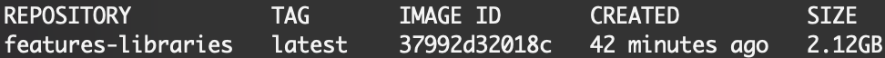
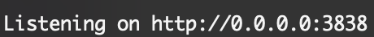

### Structure of this repository
The folders in this project contain the code, datasets and results for the paper "Uncovering Library Features from API Usage on Stack Overflow".

The description of each folder in the repository is described below:

**Folder feature_lists_libraries**

This folder contains the 50 initial libraries considered to perform the study.
The files in the folder list a number of features for each library.
However, many of the features in the linked web pages, do not have accompanying code.

**Folder tutorial_features**

This folder contains the 7 sets of tutorial features we were able to extract from the tutorial web sites.
A copy of the folder is used for the evaluation.

**Folder github_usages**

This folder contains the API usages extracted from GitHub usages. 
A copy of the folder is used for the evaluation.

**Project island_parser**

This project contains the grammar and code for our Island Parser in order to extract information from code snippets.
We based our parser in the Java 8 Language Specification [here](https://docs.oracle.com/javase/specs/jls/se8/jls8.pdf).
This project requires a version of Java installed in the system, preferably Java 8.

**Project feature_me**

The project extracts the code and textual information from Stack Overflow (SO) posts, apply the Island Parser and generate vector combinations for each SO answer where is a library usage.

**Project github_usages_extractor**

The project clones GitHub repositories using our seven selected libraries and extracts from them the API usages using the Island parser.

**Project clusters_exploration**

This projects serves as the tool for clustering exploration where the clusters for each library can be visualised.
There are two ways of executing this tool:

1. A manual ways which requires the installation of all packages.
2. An automatic way (preferred if you only want to see the tool in action) in the form of a Docker image and container.

Both ways of deploying the tool are explained next.
The automatic way is explained first since it requires less instructions.

***Automatic deployment with Docker***

You need to have Docker installed in your system to execute this part.
Please follow the installation instructions for Docker [here](https://docs.docker.com/get-docker/).

After the Docker installation (or if you have it already installed), make sure that it is running.
Then in the root folder of this repository execute the following to build the Docker image:

```
docker build -t features-libraries .
```

Note: Please include the dot (e.g., ".") at the end of the command. It is not a typographic error :)

It should take some minutes while all libraries are downloaded, configured, and the system gets ready for the deployment, i.e., you could grab some liquid (:coffee:, :tea:) in the meantime.

A `FINISHED` message should be displayed after the process is done.
To check whether the image was built simply type:

```
docker images
```

A similar output as the one below should be produced:



To deploy the application simply run the built image specifying a port like the `8080`:

```
docker run -p 8080:3838 features-libraries
```

When the application starts listening for requests as the image below, open your browser in localhost and the selected port.



If you selected `8080` click here: [http://localhost:8080](http://localhost:8080).
Otherwise, replace the port (after the second colon) with the one you selected.

***Manual deployment***

If instead, you prefer to do a manual setup, follow the next instructions.

You need to install [R](https://cran.r-project.org/mirrors.html) and [Python](https://www.python.org/downloads/) as programming languages into your system.

Then, you could run the application in the RStudio IDE.
Download it [here](https://www.rstudio.com/products/rstudio/download/) and follow the installation instructions.

Please install the following libraries for R.
You can do so in RStudio or in the R console:

* dynamicTreeCut
* stringr
* cluster
* clValid
* dplyr
* shiny
* shinycssloaders
* treemap
* highcharter
* RColorBrewer
* ggplot2
* parallel
* lvplot
* knitr
* rmarkdown
* reticulate

For Python, please install the following packages:

* numpy
* pandas
* scikit-learn

After the installation of the packages/libraries, configure the `reticulate` R library by adding the following line to the file `~/.Renviron`:

```
RETICULATE_PYTHON="full/path/to/your/python/executable"
```

Note: If the file is not created, please do so.

Please, add the full path to your installed Python executable.
Most of the times this path is located in `/usr/bin/python3` or `/usr/local/bin/python3` for Unix-based systems.

Finally, you can run the application in RStudio by opening one of the files related to the [Shiny](https://shiny.rstudio.com/) configuration (i.e., `global.R`, `server.R` or `ui.R`) and pressing the top green play button called `Run App`.

**Folder uncovered_features**

The folder contains the generated features from the **clusters_exploration** tool above.
They are presented in the form of condensed HTML files accessible from any web browser.

**Folder images**

Finally, this folder contain some snapshots of the *cluster_exploration* tool.